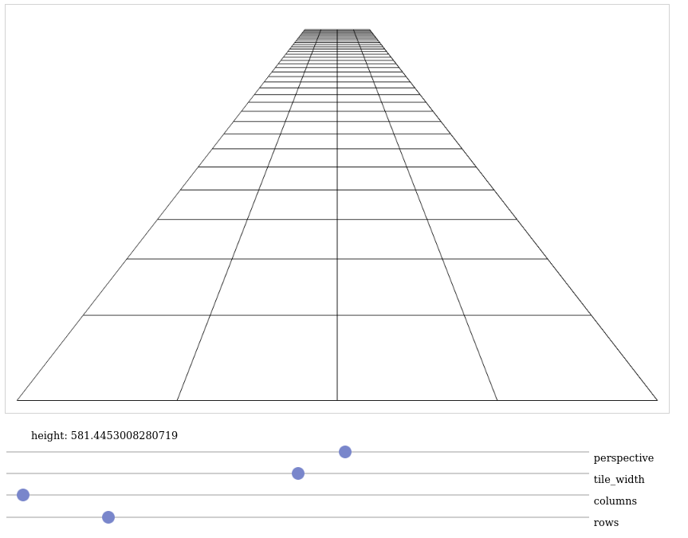

# grid_js
Code to make a perspective grid in JS.
Trying out algorithm to create the grid in a simple to understand way for another project.

# Installation
- Clone the project
- Open index.html with your browser
